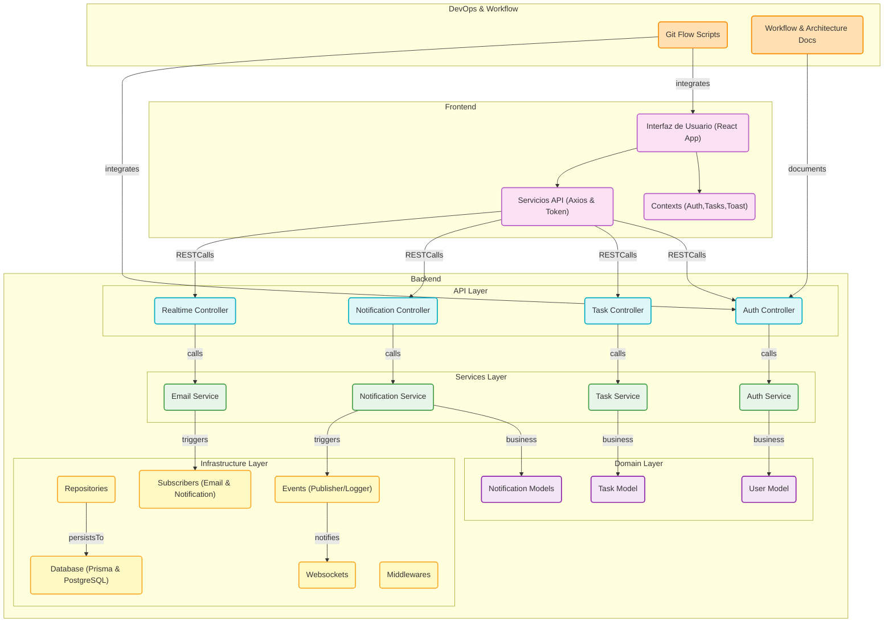

# Diagrama de Arquitectura TaskMaster

Este diagrama muestra la arquitectura completa de la aplicación TaskMaster, incluyendo las capas de Frontend, Backend, y la infraestructura subyacente.

## Explicación del Diagrama

El diagrama muestra las siguientes capas y componentes de la aplicación:

### Frontend
- **Interfaz de Usuario**: La aplicación React que interactúa con el usuario
- **Contexts**: Gestión de estado global con React Context (Auth, Tasks, Toast)
- **Servicios API**: Capa de comunicación con el backend usando Axios

### Backend (Arquitectura DDD-Light)
- **API Layer**: Controladores que reciben las peticiones HTTP
- **Services Layer**: Lógica de negocio y orquestación de operaciones
- **Domain Layer**: Modelos de dominio y reglas de negocio
- **Infrastructure Layer**: Comunicación con bases de datos, eventos y otros servicios externos

### DevOps & Workflow
- Herramientas y documentación para gestionar el ciclo de vida del desarrollo

## Flujo de Datos
Las flechas representan el flujo de datos y las dependencias entre los diferentes componentes de la aplicación.
